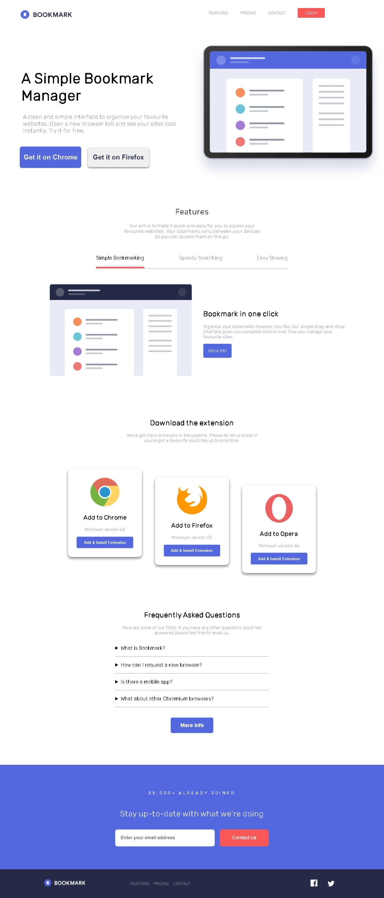

# Frontend Mentor - Bookmark landing page solution

This is a solution to the [Bookmark landing page challenge on Frontend Mentor](https://www.frontendmentor.io/challenges/bookmark-landing-page-5d0b588a9edda32581d29158). Frontend Mentor challenges help you improve your coding skills by building realistic projects. 

## Table of contents

- [Overview](#overview)
  - [The challenge](#the-challenge)
  - [Screenshot](#screenshot)
  - [Links](#links)
- [My process](#my-process)
  - [Built with](#built-with)
  - [What I learned](#what-i-learned)
- [Author](#author)
- [Acknowledgments](#acknowledgments)
*

## Overview

### The challenge

Users should be able to:

- View the optimal layout for the site depending on their device's screen size
- See hover states for all interactive elements on the page
- Receive an error message when the newsletter form is submitted if:
  - The input field is empty
  - The email address is not formatted correctly

### Screenshot

### Links

- Solution URL: [here](https://github.com/macluiggy/bookmark-langing-frontend-mentor)
- Live Site URL: [here](https://bookmark-langind-page.netlify.app/)

## My process

### Built with

- Semantic HTML5 markup
- CSS custom properties
- Flexbox
- CSS Grid
- Mobile-first workflow
- [React](https://reactjs.org/) - JS library
- [Sass](https://sass-lang.com/) - CSS preprocessor

### What I learned

Thi project was useful to practice react and its fundamental concepts like:

- Comunicating components with each other
- Using the state object
- Calling functions to change the state of the tabs, when the user click in one tab, it change the focus to it and change the image corresponding to the current tab
- Passing a method to a component as a prop
## Author

- Frontend Mentor - [@macluiggy](https://www.frontendmentor.io/profile/macluiggy)
- LinkedIn - [Luiggy Macias](https://www.linkedin.com/in/luiggy-macias-402696155/)

## Acknowledgments

I want to thank to the frontend mentor team for give this kind of project, so we can improve our frontend skills by building projects
